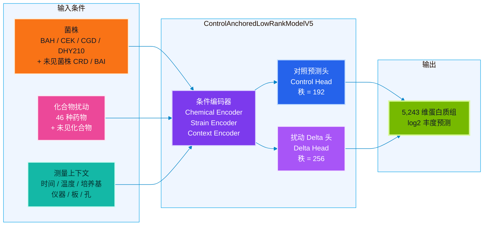
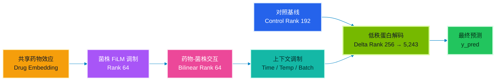

# GOAI 虚拟细胞酵母蛋白模型

<p align="center">
  <b>Control-Anchored Low-Rank Virtual Yeast Perturbation Predictor</b><br>
  在未见化合物、未见菌株及双重未知条件下，预测完整的 5,243 维酵母蛋白质组响应。
</p>

<p align="center">
  
  
  
  
  
</p>

---


## 0. 项目一句话

**GOAI Virtual Yeast Model V5** 是一个面向 [GOAI「前沿探索 AI for Research」虚拟细胞赛道](https://goai.ai) 的酿酒酵母蛋白质组预测项目。给定菌株、化合物扰动、时间、温度和测量上下文，模型输出完整的 5,243 维 log2 蛋白丰度向量，并在**未见化合物 (S1)、未见菌株 (S2) 和双重未知 (S3)** 条件下进行可靠外推。

> 当前仓库定位：**无测试泄漏的完整数据治理 + 对照锚定低秩蛋白空间解码 + 4 折 LOSO 菌株外推评估**。

---

## 1. 为什么做这个项目：科学背景与真实挑战

传统黑盒模型可以拟合训练集，但在面对新化合物、新菌株时会大幅退化。竞赛的核心考察点是**模型对未知条件的外推与泛化能力**，而不是对已知数据的记忆。

在高维蛋白质组学预测中，存在三大工程挑战：

1. **高维度 × 小样本**：5,243 个蛋白 × 数千个样本，直接全连接预测面临严重的过拟合和计算瓶颈；
2. **约 27% 缺失值**：蛋白质组数据天然存在大量未观测位，不能简单填充后当作真值训练；
3. **测试泄漏风险**：如果将测试蛋白真值混入训练、统计量计算或模型选择，会造成虚假高分。

因此本项目不只是做蛋白质组预测，更是建立一个**从审计、治理到消融验证的严格 AI4Science 实验体系**。



## 2. 核心架构：对照锚定 + 低秩蛋白质组解码




模型核心创新在于**不对每个样本运行完整的蛋白图 GAT**，而是先对全蛋白矩阵进行低秩 PCA 分解，再在低维潜空间中预测对照基线与扰动增量：

| 组件 | 维度 | 说明 |
|------|------|------|
| control_rank | 192 | 对照基线低秩空间 |
| delta_rank | 256 | 扰动效应低秩空间 |
| hidden_dim | 256 | 编码器隐层维度 |
| film_rank | 64 | 菌株 FiLM 调制秩 |
| interaction_rank | 64 | 药物-菌株交互秩 |
| **总参数量** | **3.84M** | 约 15 秒/epoch (RTX 4060) |

## 3. 数据治理：防泄漏体系

```mermaid
%%{init: {"theme": "base", "themeVariables": {"fontFamily": "Inter, Microsoft YaHei, sans-serif", "background": "#FFFFFF", "primaryColor": "#2563EB", "primaryTextColor": "#0F172A", "primaryBorderColor": "#67E8F9", "secondaryColor": "#7C3AED", "tertiaryColor": "#E0F2FE", "lineColor": "#0284C7", "clusterBkg": "#EFF6FF", "clusterBorder": "#0EA5E9", "edgeLabelBackground": "#FFFFFF"}}}%%
flowchart LR
    Q1["Q1 测试标签隔离<br/>TEST LABEL QUARANTINE"]:::q1
    Q2["Q2 化合物冲突<br/>修复 16 个 collision"]:::q2
    Q3["Q3 缺失值治理<br/>observed_mask loss"]:::q3
    Q4["Q4 PCA / Imputer<br/>每个 fold 独立拟合"]:::q4
    Q5["Q5 菌株隔离<br/>BAI 未进入训练"]:::q5
    Q6["Q6 上下文防记忆<br/>embedding + dropout"]:::q6
    Q7["Q7 无全图 GAT<br/>低秩解码替代"]:::q7
    SAFE["数据安全体系<br/>通过全部 10 项审计"]:::safe

    Q1 --> Q2 --> Q3 --> Q4 --> Q5 --> Q6 --> Q7 --> SAFE

    classDef q1 fill:#EF4444,stroke:#FECACA,color:#FFFFFF,stroke-width:2px;
    classDef q2 fill:#F97316,stroke:#FFEDD5,color:#111827,stroke-width:2px;
    classDef q3 fill:#FACC15,stroke:#FEF08A,color:#422006,stroke-width:2px;
    classDef q4 fill:#06B6D4,stroke:#CFFAFE,color:#083344,stroke-width:2px;
    classDef q5 fill:#2563EB,stroke:#DBEAFE,color:#FFFFFF,stroke-width:2px;
    classDef q6 fill:#7C3AED,stroke:#DDD6FE,color:#FFFFFF,stroke-width:2px;
    classDef q7 fill:#EC4899,stroke:#FCE7F3,color:#FFFFFF,stroke-width:2px;
    classDef safe fill:#22C55E,stroke:#BBF7D0,color:#052E16,stroke-width:3px;
```



| 审计项 | 状态 | 修复措施 |
|--------|------|----------|
| Q1 测试标签泄漏 | ✅ FIXED | TEST LABEL QUARANTINE 启用，测试蛋白真值从不加载 |
| Q2 化合物编码冲突 | ✅ FIXED | `{data_source}::{normalized_name}` 键修复 16 个 collision |
| Q3 Loss 在插补位计算 | ✅ FIXED | observed_mask，loss 仅在真实观测位计算 |
| Q4 预处理泄漏 | ✅ SAFE | scaler/PCA/imputer 均在当前训练 fold 内拟合 |
| Q5 BAI 混入验证 | ✅ SAFE | 4折 LOSO 严格分离，BAI 锁定不参与开发训练 |
| Q6 批次记忆风险 | ✅ FIXED | context embedding + dropout 替代 247 维大 one-hot |
| Q7 无全图 GAT | ✅ FIXED | PCA 低秩解码，约 15 秒/epoch，RTX 4060 8GB 稳定训练 |

## 4. 验证体系：4 折 LOSO + Official Validation

```mermaid
%%{init: {"theme": "base", "themeVariables": {"fontFamily": "Inter, Microsoft YaHei, sans-serif", "background": "#FFFFFF", "primaryColor": "#2563EB", "primaryTextColor": "#0F172A", "primaryBorderColor": "#67E8F9", "secondaryColor": "#7C3AED", "tertiaryColor": "#E0F2FE", "lineColor": "#0284C7", "clusterBkg": "#EFF6FF", "clusterBorder": "#0EA5E9", "edgeLabelBackground": "#FFFFFF"}}}%%
flowchart LR
    subgraph CV["4 折 LOSO 交叉验证"]
        F0["Fold 0<br/>留出 BAH"]:::fold0
        F1["Fold 1<br/>留出 CEK"]:::fold1
        F2["Fold 2<br/>留出 CGD"]:::fold2
        F3["Fold 3<br/>留出 DHY210"]:::fold3
    end

    subgraph VAL["Official Validation 锁定"]
        S1["val_chem_only<br/>S1：新化合物"]:::s1
        S2["val_strain_only<br/>S2：新菌株 BAI"]:::s2
        S3["val_both<br/>S3：双重未知"]:::s3
        T["val_time<br/>时间外推"]:::time
    end

    CV -->|消融选模| VAL
    VAL -->|冻结 A0| FINAL["Final Refit<br/>3 seeds 等权集成"]:::final

    classDef fold0 fill:#06B6D4,stroke:#CFFAFE,color:#083344,stroke-width:2px;
    classDef fold1 fill:#2563EB,stroke:#DBEAFE,color:#FFFFFF,stroke-width:2px;
    classDef fold2 fill:#7C3AED,stroke:#DDD6FE,color:#FFFFFF,stroke-width:2px;
    classDef fold3 fill:#A855F7,stroke:#F3E8FF,color:#FFFFFF,stroke-width:2px;
    classDef s1 fill:#F59E0B,stroke:#FEF3C7,color:#111827,stroke-width:2px;
    classDef s2 fill:#EF4444,stroke:#FECACA,color:#FFFFFF,stroke-width:2px;
    classDef s3 fill:#EC4899,stroke:#FCE7F3,color:#FFFFFF,stroke-width:2px;
    classDef time fill:#14B8A6,stroke:#CCFBF1,color:#042F2E,stroke-width:2px;
    classDef final fill:#76B900,stroke:#D9F99D,color:#111827,stroke-width:3px;
```



### 消融实验结果 (4-fold LOSO, 40 epochs)

| 实验 | 描述 | S2 R² |
|------|------|--------|
| **V5-A0** | 低秩基线 | **0.9829 ± 0.0025** |
| V5-A2a | +S2 Episodic Loss (w=0.25) | 0.9846 (+0.0017) |
| V5-A3-0.2 | +Strain Dropout (p=0.20) | 0.9836 (+0.0007) |

> A2a 和 A3 的改进低于 LOSO fold 间标准差（±0.0025），不足以证明具有稳定增益。因此冻结 A0 作为主配置。

### Official Validation (A0 Frozen, seed=42, 单次运行)

| Split | n | Sample Corr. | R² | FC PCC | 说明 |
|-------|---|-------------|-----|--------|------|
| **val_chem_only** | 1,065 | 0.9921 | 0.9839 | — | S1: 新化合物，已见菌株 |
| **val_strain_only** | 1,547 | 0.9834 | 0.9668 | 0.6437 | S2: 新菌株 BAI |
| **val_both** | 269 | 0.9828 | 0.9658 | — | S3: 双重未知 |
| **val_time** | 157 | 0.9908 | 0.9824 | 0.7323 | 时间外推 |

> **关键发现**：BAI 菌株 R²=0.967, FC PCC=0.644。S2 仍是瓶颈，但其绝对丰度预测的泛化能力显著优于随机基线。

### Final Refit

| 属性 | 值 |
|------|-----|
| 训练样本 | 8,958 (train + 全部 val splits) |
| 种子 | 42, 2026, 3407 |
| Epochs | 35 |
| 集成方式 | 等权均值 |

| Seed Pair | 预测 PCC |
|-----------|----------|
| 42 × 2026 | 0.9987 |
| 42 × 3407 | 0.9987 |
| 2026 × 3407 | 0.9991 |

三 seed 高度一致，未排除任何 seed。

## 5. 项目亮点

| 亮点 | 说明 |
|------|------|
| 🔒 完整数据治理 | 10 项审计全部通过；test proteome 从未参与训练、选模或集成 |
| 🎯 对照锚定建模 | 分离 control baseline 与 perturbation delta，显式建模药物扰动效应 |
| 📐 低秩蛋白质组解码 | PCA 降维替代逐样本全图 GAT，3.84M 参数，~15 秒/epoch |
| 🧬 菌株泛化评估 | 4 折 LOSO leave-one-strain-out，模拟 S2 未见菌株场景 |
| 🧪 严格消融实验 | A0 → A2a → A3-0.2 消融链，每个版本可复现 |
| 📊 官方指标对齐 | 六模块评分、对照匹配、药物残差计算全部基于训练数据 |
| ⚡ 轻量高效 | RTX 4060 8GB 稳定训练，CPU 推理 <100ms |

## 6. 目录结构

```text
goai-virtual-yeast-model/
├── README.md                  ← 你在这里
├── LICENSE                    ← MIT
├── CITATION.cff               ← 引用信息
├── requirements.txt           ← 依赖清单
├── environment.yml            ← Conda 环境
├── pyproject.toml             ← 项目元数据
├── .gitignore                 ← 排除数据/权重/密钥
│
├── configs/
│   └── model_v5_best.yaml     ← 冻结的 A0 配置
│
├── src/                       ← 模型与训练代码
│   ├── data_processor_v5.py   ← 防泄漏数据加载
│   ├── splits_v5.py           ← LOSO 交叉验证分裂
│   ├── model_v5.py            ← ControlAnchoredLowRankModelV5
│   ├── losses_v5.py           ← masked loss + stable corr
│   ├── scoring_v5.py          ← 六模块评分
│   ├── train_v5.py            ← 消融训练框架 (A0-A5)
│   ├── run_v5.py              ← official_val / final_refit / predict
│   ├── control_matching_v5.py ← 对照匹配模块
│   ├── predict_v5.py          ← 测试预测生成
│   └── utils_v5.py            ← 工具函数
│
├── scripts/                   ← 运行脚本
│   ├── train_cv.ps1           ← CV 训练
│   ├── train_final.ps1        ← final refit
│   ├── predict_test.ps1       ← 测试预测
│   └── validate_submission.py ← 提交校验
│
├── docs/                      ← 详细文档
│   ├── METHOD.md              ← 方法说明
│   ├── RESULTS.md             ← 实验结果
│   ├── DATA_AND_COMPLIANCE.md ← 数据安全与合规
│   ├── REPRODUCIBILITY.md     ← 复现指南
│   ├── MODEL_CARD.md          ← 模型卡片
│   └── OPEN_SOURCE_PLAN.md    ← 开源计划
│
├── reports/                   ← 诊断与审计报告
│   ├── model_v5_code_audit.md
│   ├── model_v5_a2_diagnosis.md
│   ├── model_v5_ablation_report.md
│   └── model_v5_official_val_report.md
│
├── artifacts/                 ← 配置清单与验证指标
│   ├── frozen_config_manifest.json
│   ├── model_v5_manifest.json
│   └── official_val_metrics.json
│
├── examples/
│   └── prediction_sample.csv  ← 预测样例 (10行 × 21列)
│
├── data/
│   └── README.md              ← 数据获取说明
│
└── tests/                     ← 单元测试
    ├── test_imports.py
    ├── test_model_shapes.py
    └── test_no_data_leakage.py
```

## 7. 快速开始

### 7.1 安装

```bash
git clone https://github.com/ibh4/goai-virtual-yeast-model.git
cd goai-virtual-yeast-model
pip install -r requirements.txt
```

### 7.2 数据准备

从 GOAI 官方渠道获取授权数据，放置到 `data/` 目录：

```text
data/
├── WAYB_WAYC_metadata_train_val.csv
├── WAYB_WAYC_proteome_raw_train_val.csv
└── WAYB_WAYC_metadata_test.csv
```

> ⚠️ `WAYB_WAYC_proteome_raw_test.csv` 包含测试蛋白真值，本代码通过 TEST LABEL QUARANTINE 机制禁止加载该文件。

### 7.3 训练

```bash
# 交叉验证 (单折)
python -m src.train_v5 --ablation A0 --fold 0 --epochs 40 --batch_size 24

# Official Validation (冻结配置, 只运行一次)
python -m src.run_v5 --mode official_val --seed 42

# Final Refit (3 seeds)
python -m src.run_v5 --mode final_refit --seed 42
python -m src.run_v5 --mode final_refit --seed 2026
python -m src.run_v5 --mode final_refit --seed 3407

# 生成测试预测
python -m src.run_v5 --mode predict
```

### 7.4 测试

```bash
pytest -q    # 11 passed
```

## 8. 局限性与后续计划

| 局限性 | 后续方向 |
|--------|----------|
| S2 (未见菌株) R²=0.967 弱于 S1 (R²=0.984) | 菌株基因组特征 (SNP/CNV/auxotrophy) |
| ~27% 缺失值限制低丰度蛋白预测精度 | 通路级损失 + 高可靠蛋白优先 |
| PCA 主要解释绝对丰度方差 | 药物 FC 特异的低秩分解 |
| 未使用化合物结构信息 | Morgan fingerprint / SMILES embedding |
| 完整 DEP 模块尚未拆分验证 | 六模块独立评估 + 消融 |

## 9. 开源与许可

- 代码：**MIT License**
- 官方 GOAI 数据：**不随仓库分发**，需从赛事组委会获取并遵守数据使用协议
- 本仓库提供完整的复现流程、冻结配置和随机种子

## 10. 引用

```bibtex
@software{goai_virtual_yeast_2026,
  author = {Peng, Weichao},
  title = {GOAI Virtual Yeast Model: Control-Anchored Low-Rank Virtual Yeast Perturbation Predictor},
  year = {2026},
  url = {https://github.com/ibh4/goai-virtual-yeast-model},
}
```

---

<p align="center">
  <b>GOAI Virtual Yeast Model V5</b><br>
  <sub>面向 GOAI AI for Research 虚拟细胞赛道 · 酿酒酵母扰动蛋白质组预测</sub><br>
  <sub>TEST LABEL QUARANTINE: ENABLED · TEST PROTEOME LOADED: FALSE</sub>
</p>
